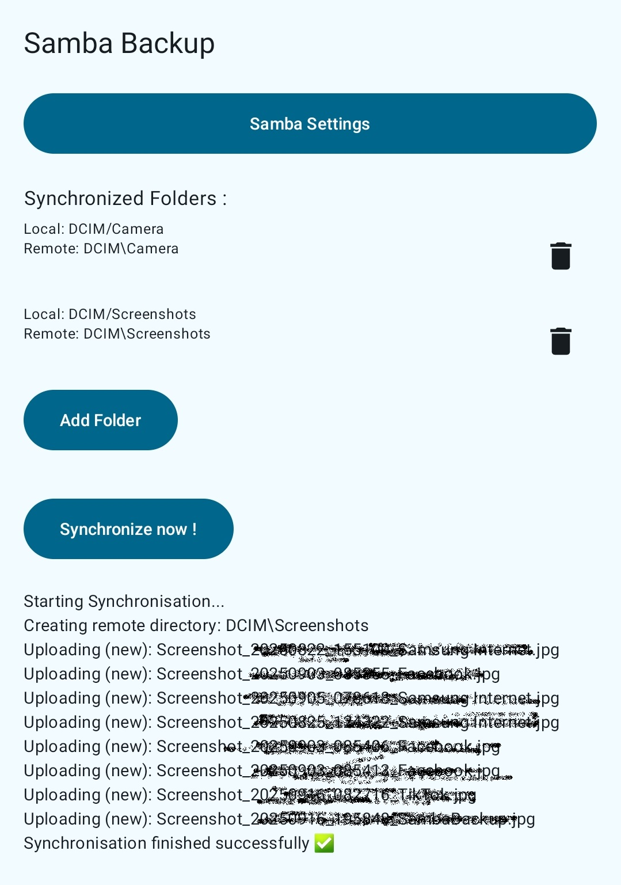

# Android Samba Backup

Automatically back up and sync your files from Android to a Samba (SMB v2/v3) network share.

---

## Features

- **Easy Server Configuration**  
  Set your Samba server’s IP, username, password and share name directly in the app.

- **Custom Backup Rules**  
  Define local and remote folder pairs to control exactly what gets backed up.

- **Manual Synchronization**  
  - Uploads files created within the last 30 days that aren’t already on the server.  
  - Deletes recent files (<30 days) on the server that have been removed locally. Typical usage : Delete blurry or unwanted photos from local storage and reflect the changes on the server.

- **Permissions & Compatibility**  
  - `READ_EXTERNAL_STORAGE`: access files for backup.  
  - `WRITE_EXTERNAL_STORAGE`: optional for config and logs.  
  - `INTERNET`: connect to the Samba server.  
  Fully compatible with modern Android storage models.

